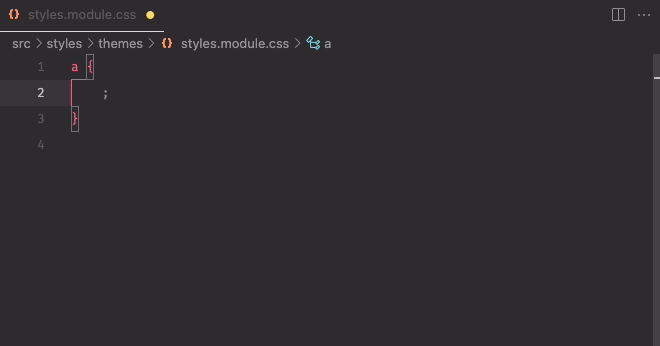

# Design Tokens Intellisense Extension for VS Code

This extension provides autocompletion for CSS, SASS and SCSS variable names defined in a global file within your project.

## Features

- Autocompletion of CSS, SASS and SCSS variable names while typing `var(--`.

## Installation

To install this extension:

1. Download the `.vsix` file from the GitHub repository in the [Releases Section](https://github.com/ricardolmsilva/design-tokens-intellisense/releases).
2. Open Visual Studio Code.
3. Go to the Extensions view (Ctrl+Shift+X).
4. Click on the More (...) button at the top of the Extensions view, point to `Install from VSIX...`.
5. Navigate to the `.vsix` file and click `Open`.

## Usage

After installation, when editing CSS, SASS or SCSS files, you will see autocomplete suggestions pop up after typing `var(--`.

The variable suggestions come from the `_corporate-theme.*` file within your workspace.

## Contributing

This extension is a private project. If you have suggestions or improvements, please raise issues or submit PRs in the GitHub repository.

## License

This extension is distributed under the MIT license.
